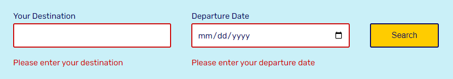
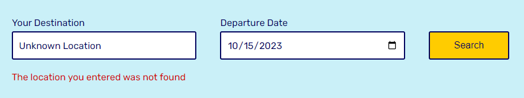
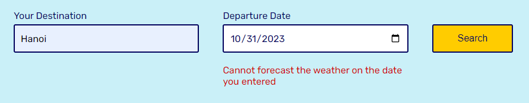
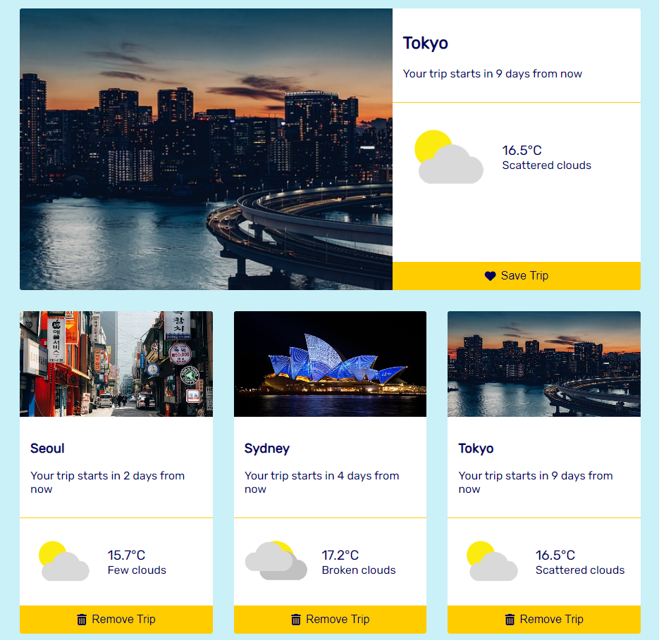

# Capstone Project: Travel Planner App

## Project Overview

We will be building a travel application.

The web application includes a simple form where you enter the location you are traveling to and the date you are leaving. Then the web will display the weather forcast on the screen. You can save or remove the trip.

Behind the scenes, we will get the coordinates from the [Geonames API](http://www.geonames.org/export/web-services.html), then pass them to [Weatherbit API](https://www.weatherbit.io/account/create) to get the weather forecast. Once we have all of this data, we will be using the [Pixabay API](https://pixabay.com/api/docs/) to display an image of the location entered.

## How to Use

-   Install the latest [NodeJS](https://nodejs.org/en/download) (current version 18.18.0).
-   Run `npm install` in terminal to install all the required packages.
-   Create 3 accounts on Geonames, Weatherbit, and Pixabay and get 3 API keys.
-   Rename `.env-SAMPLE` file to `.env` and enter your own API keys.
-   Run `npm run build-prod` to build the production webpack.
-   Run `npm run start` to start the server on port `3001`.
-   Run `npm run build-dev` to build the development webpack and open the web app on port `3000`.
-   Run `npm run test` to test the app with Jest.

## App Features

-   Handle invalid user input:
    

-   Handle unknown location:
    

-   Handle unknown date:
    

-   Search and display trip, save and remove trip:
    

-   Responsive on tablet:
    

-   Responsive on phone:
    

## References

-   https://webpack.js.org/guides/production
-   https://fontawesome.com/
-   https://fonts.google.com/
-   https://stackoverflow.com/questions/3066586/get-string-in-yyyymmdd-format-from-js-date-object
